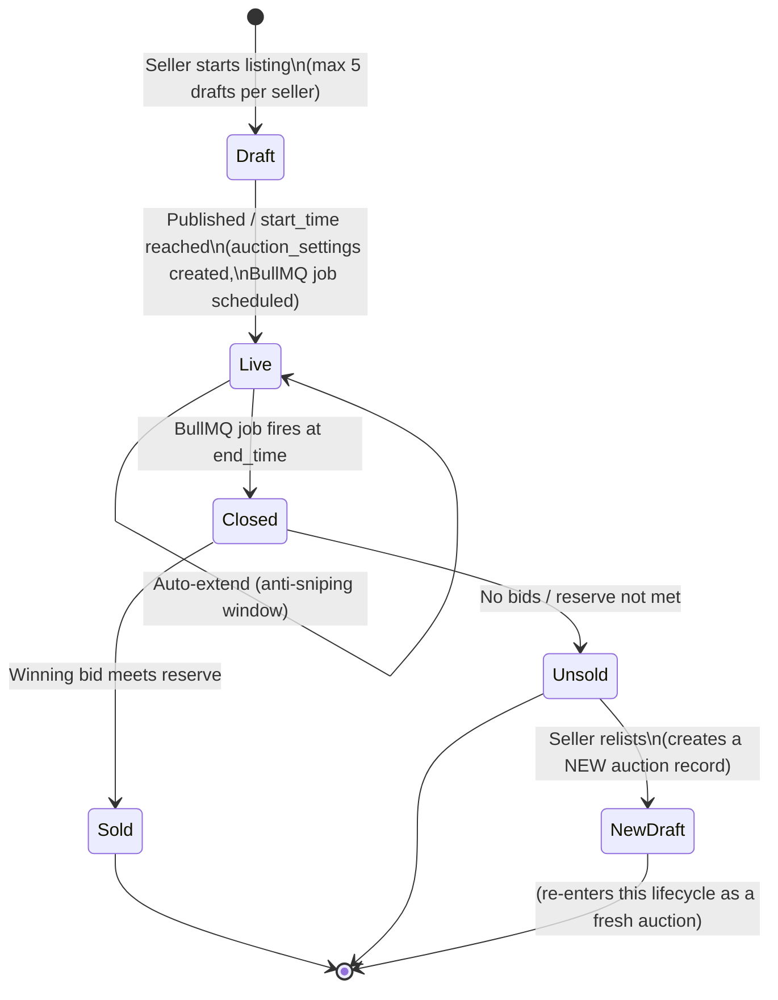
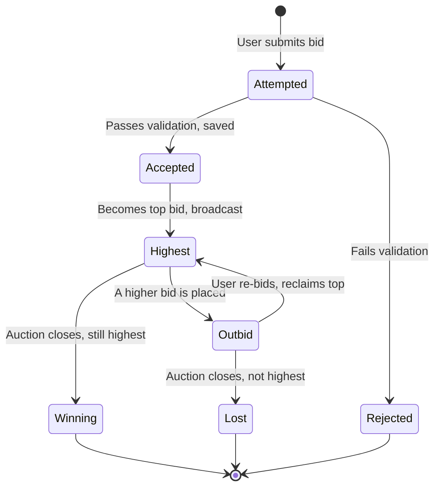
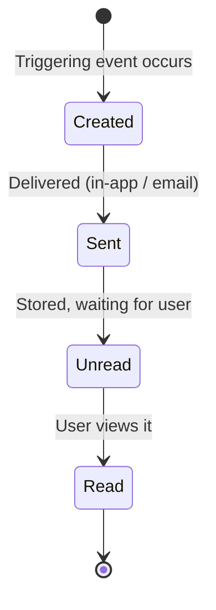
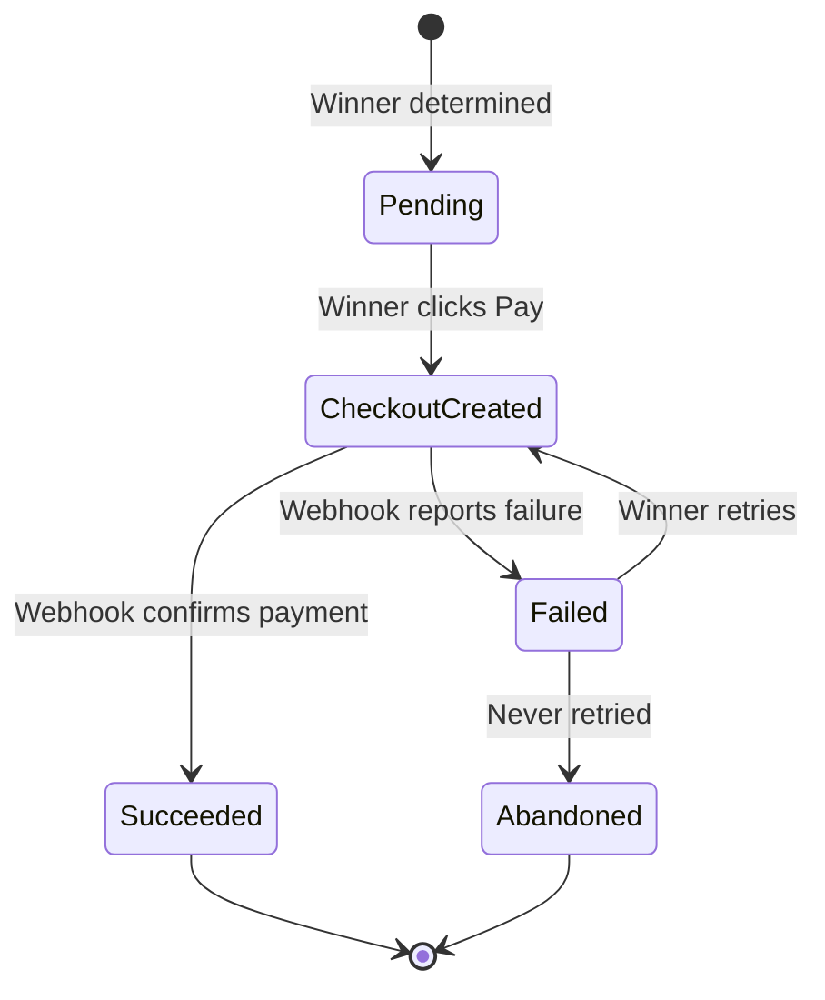
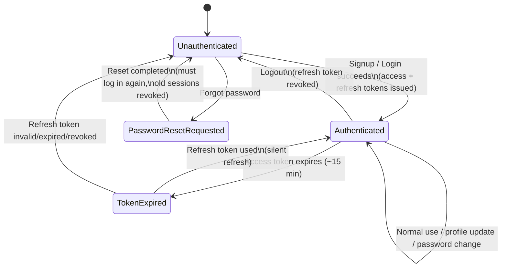

# Auction Platform — Lifecycle Diagrams

Draft version — review this and tell me what to fix, add, or remove. Each lifecycle has a plain-text version (fast to read/edit) and a Mermaid state diagram (visual).

---

## 1. Auction Lifecycle

**Text version:**
```
[*] 
  → Draft         Seller starts a listing, saved as draft (not published yet)
                  → Rule: a seller may have at most 5 unpublished drafts at once;
                     the 6th draft attempt is blocked until one is published or deleted
Draft 
  → Live          Seller publishes the auction / start_time is reached
                  → auction_settings row created alongside it
                  → BullMQ auction-end job scheduled for end_time
                  → Event logged: auction.created
Live 
  → Live          A bid is placed (auction stays live, highest bid updates)
  → Live          Auto-extend triggers if a bid lands in the anti-sniping window (end_time pushed back)
  → Closed        BullMQ worker fires exactly at end_time
                  → Event logged: auction.closed
Closed 
  → Sold          A winning bid exists and meets the reserve price (if any)
                  → Event logged: auction.sold
                  → Notification created for the winner
  → Unsold        No bids were placed, OR the reserve price was never met
                  → Event logged: auction.unsold
                  → Terminal state — this auction record is NOT reused
Sold / Unsold 
  → [*]           End of lifecycle for THIS auction record

Unsold 
  → (Relist)      Seller may relist: this creates a brand NEW auction (new id, new bid
                  history), typically pre-filled from the old listing's data. It is a
                  new instance of this same lifecycle, not a state change on the old one.
```

**Mermaid diagram:**


---

## 2. Bid Lifecycle

**Text version:**
```
[*] 
  → Attempted     User submits a bid via Socket.io
Attempted 
  → Rejected      Fails validation: too low, auction not live, or lost a race condition
  → Accepted      Passes validation, saved to Postgres, Redis highest-bid cache updated
Accepted 
  → Highest       This bid is currently the top bid; broadcast to everyone in the room
Highest 
  → Outbid        Someone else places a higher bid
Outbid 
  → Highest       This user bids again and reclaims the top spot
  → Lost          Auction closes while this bid is not the highest
Highest 
  → Winning       Auction closes (BullMQ job fires) while this bid is still the highest
Winning / Lost / Rejected 
  → [*]           End of lifecycle
```

**Mermaid diagram:**


---

## 3. Notification Lifecycle

**Text version:**
```
[*] 
  → Created       Triggering event occurs (auction closed, outbid, payment result, etc.)
                  → Event logged: notification.sent (once delivered)
Created 
  → Sent          Notification delivered (in-app via Socket.io, and/or email)
Sent 
  → Unread        Stored in the notifications table, waiting for the user
Unread 
  → Read          User opens/views the notification
Read 
  → [*]           End of lifecycle
```

**Mermaid diagram:**


---

## 4. Payment Lifecycle

**Text version:**
```
[*] 
  → Pending           Winner is determined, payment step unlocked for them
Pending 
  → CheckoutCreated   Winner clicks "Pay"; Stripe Checkout session created
CheckoutCreated 
  → Succeeded         Stripe webhook confirms payment
                      → Event logged: payment.succeeded
  → Failed            Stripe webhook reports failure / card declined
                      → Event logged: payment.failed
Failed 
  → CheckoutCreated   Winner retries payment
  → Abandoned         Winner never retries (optional timeout/cleanup logic)
Succeeded / Abandoned 
  → [*]               End of lifecycle
```

**Mermaid diagram:**


---

---

## 5. Auth / Session Lifecycle

**Text version:**
```
[*] 
  → Unauthenticated     No valid session (new visitor, or logged out, or refresh token invalid)

Unauthenticated 
  → Authenticated       Signup or Login succeeds
                         → Access token issued (short-lived, ~15 min)
                         → Refresh token issued + stored in Redis
                         → Event logged: auth.signup or auth.login

Authenticated 
  → Authenticated       Normal use — access token is still valid, requests succeed
  → TokenExpired        Access token passes its ~15 min expiry

TokenExpired 
  → Authenticated       Frontend silently uses the refresh token to get a new access token
  → Unauthenticated     Refresh token is also expired, invalid, or was revoked → must log in again

Authenticated 
  → Unauthenticated     User logs out → refresh token revoked/deleted from Redis
                         → Event logged: auth.logout

Unauthenticated 
  → PasswordResetRequested   User clicks "Forgot password", requests a reset email
                              → A password_reset row is created in verification_tokens
                                (hashed token, expiry set); raw token emailed as a link
                              → Event logged: auth.password_reset_requested

PasswordResetRequested 
  → Unauthenticated     User completes the reset (sets a new password via the emailed link)
                         → Token is validated (hash match, type, not expired, not used),
                           then marked used_at
                         → Old refresh tokens for this user are revoked (force logout everywhere)
                         → Event logged: auth.password_reset_completed
                         → User must log in again with the new password

Authenticated 
  → Authenticated       User changes password from Settings (while logged in)
                         → Other sessions' refresh tokens revoked (security best practice)
                         → Event logged: auth.password_changed
  → Authenticated       User updates account/profile info (name, avatar)
                         → Event logged: user.account_updated
```

**Mermaid diagram:**


---

## 6. Auth / Account Events Logged to event_logs

These map to the transitions above — logged for auditing, not as a separate lifecycle:

```
Event types (entity_type: "user"):
- auth.signup
- auth.login
- auth.logout
- auth.password_reset_requested   → user requests a reset link
- auth.password_reset_completed   → user successfully sets a new password via the link
- auth.password_changed           → user changes their password while logged in (settings page)
- user.account_updated            → user updates profile info (name, avatar, etc.)
```

---

## Notes / Open Questions for You to Review
- **Auction "Draft" cap** ✅ resolved — max 5 unpublished drafts per seller.
- **Unsold auctions** ✅ resolved — terminal/archived, not reused. Relisting creates a brand new auction record (standard real-world pattern, same as eBay's "relist"/"sell similar").
- **Bid "Lost" status** ✅ resolved — derived, not a stored column.
- **event_logs scope** ✅ resolved — `auction.*`, `notification.*`, `payment.*`, and now `auth.*`/`user.*` events. Bid events still excluded (they live only in the `bids` table).
- **New open question:** the auth lifecycle assumes password change/reset revokes ALL of a user's other active sessions (common security practice — e.g. logged out on phone if password changed on laptop). Confirm this is what you want, or if a single-session revoke is preferred instead.
